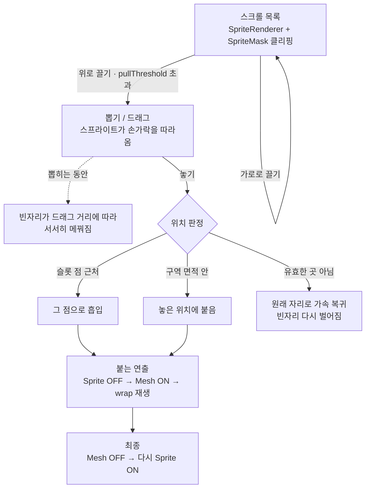
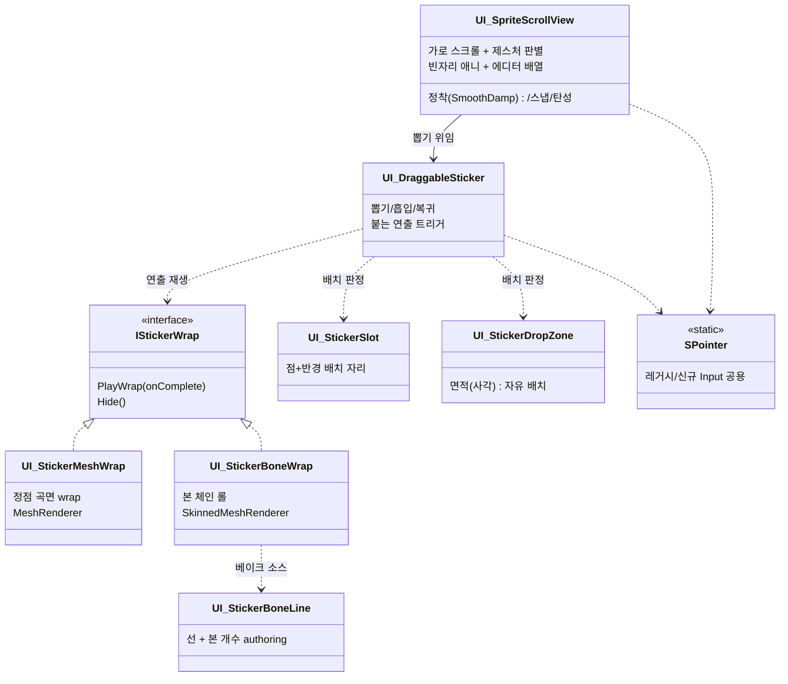
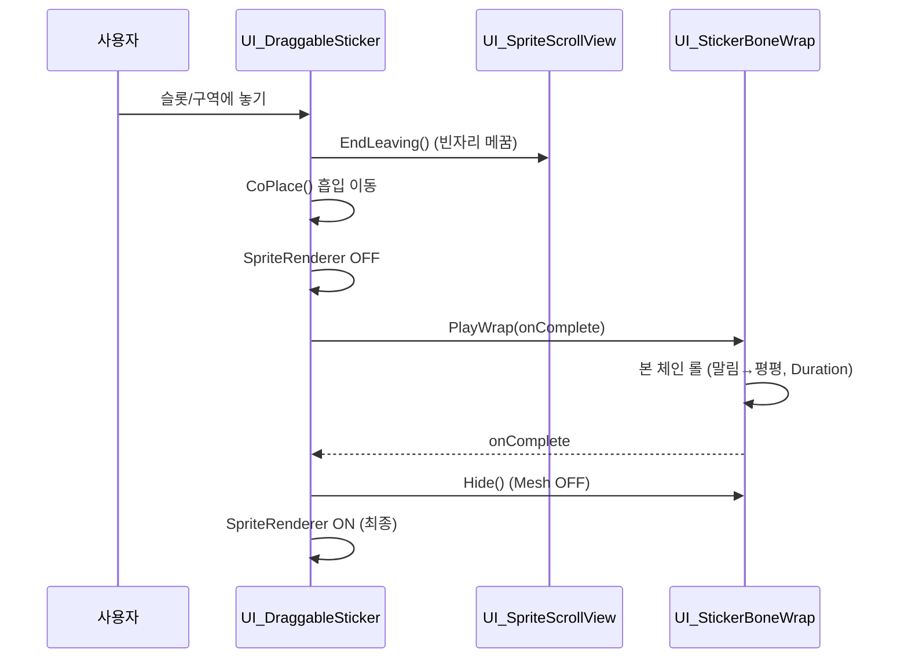

<div align="center">

# 🎯 StickerModule

**스크롤뷰에서 스티커를 뽑아 → 원하는 곳에 붙이고 → 붙는 순간 "말리는/감기는" 연출을 재생**하는 Unity 미니 모듈


</div>

---

## ✨ 한눈에 보기

- **가로 스크롤뷰** — SpriteRenderer 기반, 관성/스냅/경계 탄성, 에디터에서도 배열
- **뽑기 & 배치** — 위로 끌어 뽑고, 슬롯(점) 또는 구역(면적)에 붙이거나 원위치로 가속 복귀
- **붙는 연출** — 붙는 순간에만 Mesh로 전환해 wrap 재생, 끝나면 다시 스프라이트로
  - **정점 방식**: 곡면 wrap (MeshRenderer)
  - **본 방식**: 선을 긋고 그 위에 본을 심어 **돌돌 말렸다 풀리는** 롤 (SkinnedMeshRenderer)
- **에디터 도구** — 예시 씬 자동 생성, 원클릭 베이크, 선 그리기 UI, Play 없이 연출 프리뷰

> 📖 컴포넌트별 전체 필드/API 레퍼런스는 **[STICKER_MODULE.md](STICKER_MODULE.md)** 참고.

---

## 🎬 미리보기

> 아래 GIF/이미지는 직접 캡처해서 `docs/images/` 에 넣으면 이 자리에 표시됩니다. (캡처 가이드: [`docs/images/README.md`](docs/images/README.md))

| 스크롤 & 뽑기 | 배치 & wrap 연출 | 본 롤(돌돌 말림) |
|:---:|:---:|:---:|
|  |  |  |

---

## 🔄 전체 흐름



핵심 설계: **평소엔 가벼운 SpriteRenderer, 붙는 연출 순간에만 Mesh로 전환** 후 끝나면 스프라이트로 복귀.

---

## 🧩 컴포넌트 구조



### 씬 계층 구조 (본 베이크 후)

```
Sticker (SpriteRenderer + Collider2D + UI_DraggableSticker + UI_StickerBoneLine)
└─ WrapMesh (SkinnedMeshRenderer + UI_StickerBoneWrap)   ← 붙는 연출 동안만 ON
   └─ Bones
      ├─ Bone_0  (초록 = 시작)
      ├─ Bone_1
      └─ ...     (빨강 = 끝)
```

---

## 🎞️ 배치 시퀀스 (본 롤 기준)



---

## 🚀 빠른 시작

### 1) 예시 씬으로 바로 확인
1. Unity 메뉴 **`Tools > Gunter Sticker > Build Sample`**
2. **Play** → 아이템을 위로 뽑아 슬롯/초록 구역에 놓기 → 붙는 연출 재생

### 2) 본 롤(돌돌 말림) 직접 만들기
1. 스티커(SpriteRenderer) 오브젝트에 **`UI_StickerBoneLine`** 추가 *(샘플은 자동 부착)*
2. 인스펙터에서 **그리기 모드** 켜고 씬에서 스티커 위 클릭 → 선 긋기, **Bone Count** 설정
3. **`Bake Skinned`** 버튼 → `WrapMesh` + `Bones` + `UI_StickerBoneWrap` 생성
4. `UI_StickerBoneWrap` 인스펙터의 **`Roll` 슬라이더 / ▶ Play Preview** 로 Play 없이 확인
5. Play → 붙일 때 선 방향으로 돌돌 말렸다 풀림

### 3) 정점 wrap(선 그리기 불필요)
- 스티커 선택 → **`Bake Mesh From Sprite`** → Play 시 곡면 wrap + 팝 연출

---

## 🛠️ 에디터 메뉴

| 메뉴 | 기능 |
|---|---|
| `Tools > Gunter Sticker > Build Sample` | 스크롤뷰 + 아이템 + 슬롯 + 구역 예시 씬 자동 생성 |
| `Tools > Gunter Sticker > Bake Mesh From Sprite` | 정점 wrap 메시로 굽기 |
| `Tools > Gunter Sticker > Bake Skinned Mesh (From Bone Line)` | 본 스킨 메시(롤)로 굽기 |

인스펙터 버튼: **Bake Skinned** / **Clear Bake(베이크 제거)** / **Play Preview**

---

## 🎚️ 튜닝 요약

| 대상 | 주요 파라미터 |
|---|---|
| 스크롤 | `settleSmoothTime`, `momentum`, `snapToItem`, `spacing`, `paddingStart/End` |
| 뽑기 | `pullThreshold`, `decideThreshold` |
| 배치/복귀 | `suckDuration`, `returnDuration`, `popScale`, 슬롯 `snapDistance`, 구역 `size` |
| 정점 wrap | `wrapAngle`, `popScale`, `duration`, `overshoot` |
| 본 롤 | `bendAnglePerBone` × `Bone Count`(= 총 말림), `rollBand`, `reverse`, `duration` |

---

## ⚠️ 주의사항 / 한계

- **직교(Orthographic) 카메라**: Z 깊이 굽힘은 화면에 안 보이고 **가장자리 단축(foreshortening)** 으로만 표현됩니다. 입체적인 말림을 보려면 **Perspective** 또는 카메라를 살짝 기울이세요.
- **LBS 스키닝 한계**: 본 롤을 과하게(한 바퀴 이상 빡빡하게) 하면 정점이 겹쳐 깨질 수 있습니다 → `Bone Count`↑ · `bendAnglePerBone`↓ · `rollBand`↑ 로 완화.
- **SpriteRenderer ↔ MeshRenderer 공존 불가** → 메시는 자식 `WrapMesh` 에 둡니다.
- **선(line) ≠ 베이크 결과**: 선을 리셋해도 이미 구운 본은 남습니다 → **Clear Bake** 사용.
- 신규 Input System 사용 중이므로 입력은 **`SPointer`** 경유(직접 `UnityEngine.Input` 호출 금지).

---

## 📁 파일 구조

```
Assets/StickerModule/Scripts/
├─ UIs/Modules/
│  ├─ UI_SpriteScrollView.cs     가로 스크롤 + 제스처 + 정착/스냅 + 빈자리 애니
│  ├─ UI_DraggableSticker.cs     뽑기/흡입/복귀 + 붙는 연출 트리거
│  ├─ UI_StickerSlot.cs          점+반경 배치 자리
│  ├─ UI_StickerDropZone.cs      면적(사각) 자유 배치 구역
│  ├─ UI_StickerMeshWrap.cs      정점 곡면 wrap (MeshRenderer)
│  ├─ UI_StickerBoneWrap.cs      본 체인 롤 (SkinnedMeshRenderer)
│  ├─ UI_StickerBoneLine.cs      본 라인 authoring 데이터
│  ├─ IStickerWrap.cs            wrap 공통 인터페이스
│  └─ SPointer.cs                레거시/신규 Input 공용 포인터
└─ Editor/
   ├─ StickerMeshBaker.cs        정점/스킨 베이크 + Clear Bake
   ├─ StickerSampleBuilder.cs    예시 씬 생성
   ├─ StickerBoneLineEditor.cs   선 그리기/본 개수/베이크 버튼
   └─ StickerBoneWrapEditor.cs   롤 에디터 프리뷰
```

---

<div align="center">
자세한 레퍼런스 → <a href="STICKER_MODULE.md"><b>STICKER_MODULE.md</b></a>
</div>
